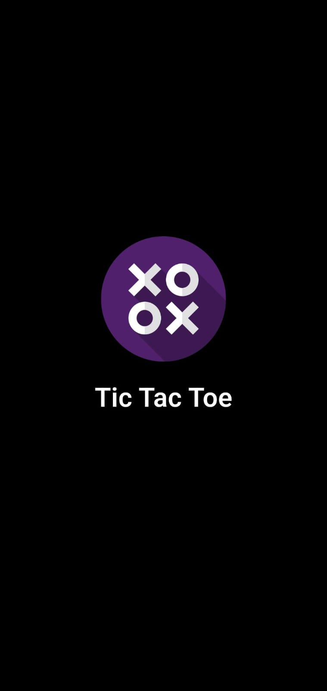
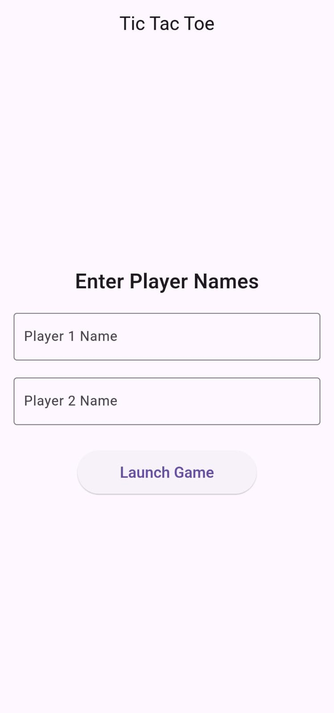
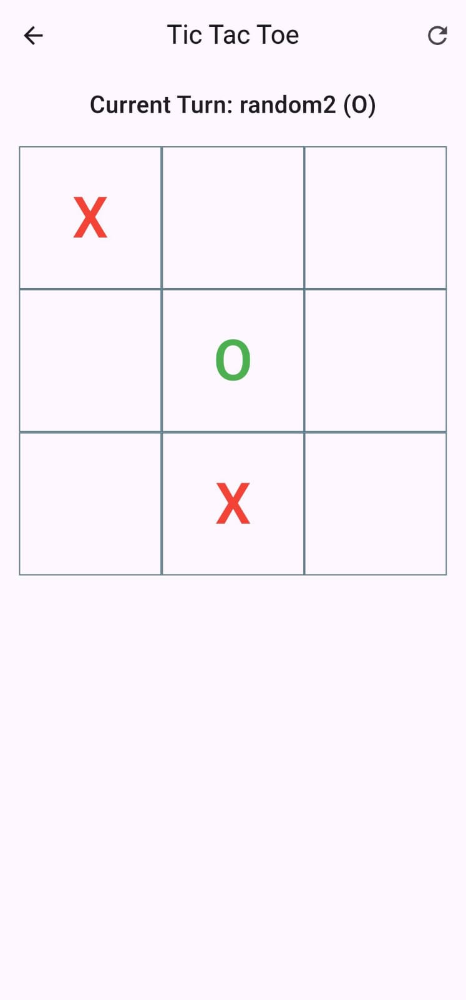
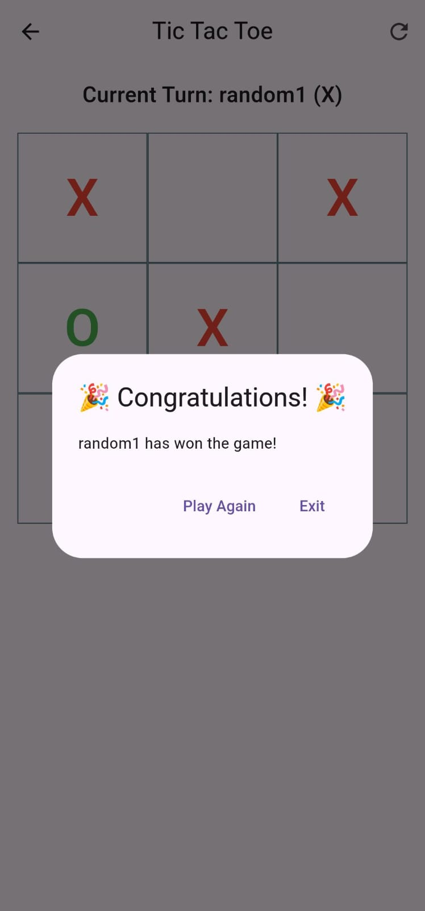

# Tic Tac Toe Game 🎮

A simple Tic Tac Toe game built using Flutter, featuring player name input, winner celebration, game reset functionality, and a footer credit. 

## Features
- **Custom Splash Screen**: Displays a splash screen with a custom logo when the app is launched.
- **Custom App Icon**: The app icon has been customized with a default logo.
- **Two Player Mode**: Enter player names and enjoy a classic game of Tic Tac Toe.
- **Winner Celebration**: Congratulatory message with confetti for the winning player.
- **Game Reset**: Reset the game with a click to play again.
- **Tie Detection**: Recognizes when the game is tied and prompts for a replay.
- **Player Turn Indicator**: Displays the current player’s turn with their symbol (`X` or `O`).
- **Responsive UI**: Designed for all screen sizes and platforms (Android, iOS).


## Screenshots
### Splash Screen

### Player Input


### Game Board


### Winner Celebration


## Installation

1. **Clone the repository**:
   ```bash
   git clone https://github.com/Kmkishore05/tic-tac-toe-flutter.git
   cd tic-tac-toe-flutter
